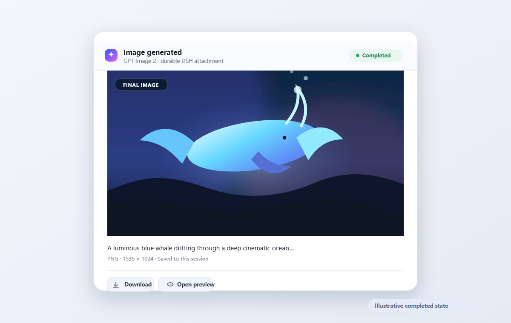

# dsh-image-gen

[](https://awesome.re) [](https://awesome-dsh-plugin.com)

[](https://github.com/LeemanCheung/dsh-image-gen/actions/workflows/ci.yml)
[](./LICENSE)

Generate images in DeepSeek Harness with OpenAI `gpt-image-2.5-flare` (or `gpt-image-2.5-sunburst` and `gpt-image-2`), using a signed-in Codex subscription by default or an API key when explicitly configured.

Linked development installs also resolve Codex Connect from the active DSH Profile. This uses the connector's public store, including its selected account in the current multi-account format, instead of mistaking an inaccessible optional dependency for a signed-out account. The same path has been verified against the installed Profile without displaying credential values.

[中文说明](./README.zh.md)

<p align="center"></p>

<p align="center"></p>

These illustrations mirror the shipped developing and completed card states. API-key mode can replace the light field with real streamed drafts; Codex subscription mode animates until its non-streaming response arrives. The completed state remains available as a durable DSH attachment with preview and download controls.

## Capability map

| Area | Delivered behavior |
| --- | --- |
| Tool and access paths | Exposes the Codex-compatible `image_gen` tool for `gpt-image-2.5-flare`, `gpt-image-2.5-sunburst`, and `gpt-image-2`; defaults to refreshable `dsh-codex-connect` subscription OAuth and can explicitly use a DSH API-key credential. |
| Progressive experience | Subscription requests show a developing animation until their non-streaming result; API-key requests can show up to three provider-sent partial images, cross-faded in place. |
| Durable results | Saves only the completed image as a DSH immutable attachment, so the same card can replay, preview in a lightbox, and download after a session reload. |
| Conversation compatibility | Returns text-only tool output to the model while retaining the image reference in UI metadata, including for nested Code Mode calls. |
| Safety boundaries | Resolves credentials per request, pins the subscription endpoint, rejects redirects, bounds response sizes and concurrency, validates image bytes through DSH, and retries only transient failures. |

## Highlights

- Registers the Codex-compatible model tool name `image_gen`.
- Selects a provider image model per call or per deployment on both access paths: GPT Image 2.5 Flare and Sunburst, plus the older `gpt-image-2`.
- Accepts the GPT Image 2.5 quality ladder (`auto`, `low`, `medium`, `high`, `xhigh`, `max`); both access paths accept the aliases, and the subscription endpoint budgets its own output from the requested tier.
- Reuses the refreshable OAuth login owned by `dsh-codex-connect`; no `OPENAI_API_KEY` is required for Codex subscription mode.
- Streams up to three real provider partial images when the API-key Images endpoint is selected; Codex subscription mode keeps the developing animation active until its non-streaming response arrives.
- Cross-fades each partial over one animated developing plate, then sharpens into the final image.
- Stores the final image in DSH's immutable attachment store and supports replay, lightbox preview, and download.
- Keeps model-facing tool output text-only, so image generation does not make a text-only model route reject conversation history.
- Supports native tool calls and nested Code Mode calls with the same durable card.
- Resolves credentials per operation, rejects redirects, limits response sizes, validates image bytes through DSH, and retries only transient failures.
- Includes Chinese and English UI copy plus `prefers-reduced-motion` support.

## Codex parity and improvements

OpenAI Codex's built-in `image_gen` tool hardcodes `gpt-image-2`, calls the ChatGPT Codex Images endpoint with subscription OAuth, records one working state, and saves the completed image under Codex's generated-images directory. Its public backend currently requests a non-streaming JSON response and its UI does not expose a distinctive diffusion animation.

`dsh-image-gen` keeps the compatible `image_gen` name and improves the visible process:

| Experience | Codex | dsh-image-gen |
| --- | --- | --- |
| GPT Image 2 (subscription endpoint) | Yes | Yes |
| GPT Image 2.5 Flare / Sunburst | No | Selectable per call or per deployment on both access paths |
| GPT Image 2.5 `xhigh` / `max` quality | No | Accepted and forwarded; the subscription endpoint still serves its own quality |
| Progressive provider frames | Subscription path is currently non-streaming | Subscription animation; API-key mode supports up to 3 live frames |
| Before first frame | Generic working state | Animated developing plate, scan, and light field |
| Frame transition | Generic activity | In-place cross-fade and focus development |
| Final result | Saved image | Durable DSH attachment, replay, lightbox, download |
| Text-only model compatibility | Not applicable to DSH history | Model receives text; image reference stays in UI metadata |
| Reduced motion | Platform dependent | Explicitly supported |

Primary references:

- [Codex image-generation tool](https://github.com/openai/codex/blob/main/codex-rs/ext/image-generation/src/tool.rs)
- [OpenAI image-generation skill](https://github.com/openai/skills/blob/main/skills/.system/imagegen/SKILL.md)
- [GPT Image 2.5 Flare model](https://developers.openai.com/api/docs/models/gpt-image-2.5-flare)
- [GPT Image 2.5 Sunburst model](https://developers.openai.com/api/docs/models/gpt-image-2.5-sunburst)
- [GPT Image 2 model](https://developers.openai.com/api/docs/models/gpt-image-2)
- [Image generation guide](https://developers.openai.com/api/docs/guides/image-generation)

## Compatibility

Verified environment:

- DeepSeek Harness `0.1.5-rc.1` (real Web host boot from this repository, plugin-tree load, `image_gen` registration, served client module, plus typecheck, deterministic build, tests, and package smoke)
- DeepSeek Harness `0.1.2-rc.1` (QA Web Profile load, plugin enablement, Host `image_gen` registration, Client tool-view load, and historical generated-card replay)
- `dsh-codex-connect` `0.1.0-alpha.4.34` for the live subscription runs (`0.1.0-alpha.4.4` was the version verified for the `0.3.x` releases)
- Node.js `24.15.0` (package support: `^22.19.0` or `>=24.0.0`)
- DSH Web profile on Windows 11
- Real Codex subscription generation, durable replay, Blob preview, and download controls

Version `0.3.2` targets `0.1.2-rc.1` and no longer claims compatibility with the alpha builds. The earlier `0.1.2-alpha.5` lifecycle result belonged to `dsh-image-gen` `0.3.1`; it is retained as history but does not transfer to this release. The `compatible` rc.1 manifest entry records the verified DSH Host/Client/tool-view integration above. A fresh subscription generation on rc.1 had reached the provider but returned HTTP 403, so that specific rc.1 claim is superseded: on DSH `0.1.5-rc.1` the same subscription path now returns HTTP 200 for `gpt-image-2.5-flare` and `gpt-image-2.5-sunburst` (2026-09-11).

Version `0.4.0` adds GPT Image 2.5 support (`gpt-image-2.5-flare` / `gpt-image-2.5-sunburst`, a per-call `model`, and the `xhigh` / `max` quality tiers). The keyless suite verifies the request shaping; live Codex subscription requests then confirmed the private endpoint accepts both 2.5 aliases, so the subscription path defaults to `gpt-image-2.5-flare` too. The real subscription runs used the signed-in ChatGPT quota, not a billed API account, so no API billing was incurred.

The same release fixes a real DSH mount failure that mocked tests could not see. `connection.rpc.handle()` registers the plugin's loopback route through `webServer.register()`, and on DSH `0.1.5-rc.1` the `connection` loader entry carries `webRuntime` but not `webServer`, so the whole plugin tree failed at boot with `cannot get property "webServer" without inject`. Because a loader entry — not a module's exported `inject` array — owns the runtime capability boundary, `cordis.patch.yml` now grants `webServer` to the `connection` entry and declares the plugin's own services. Verified by booting a real DSH Web host from this repository with an empty profile patch: the plugin tree loads, the server answers HTTP 200, and the served client module is this build.

## Install

Review third-party source before installation and pin release tags or commits. For the default keyless subscription path, install Codex Connect, sign in once, then install this plugin:

```powershell
dsh plugin --profile web add dsh-codex-connect
dsh openai-codex login
dsh plugin --profile web add github:LeemanCheung/dsh-image-gen#main
```

The published tags stop at `v0.3.1`, so a `v0.4.0` tag does not exist yet; the GPT Image 2.5 work lives on `main` and is only installable from there until that tag is created. For production, pin the exact commit you reviewed (`.../dsh-image-gen#<sha>`) rather than a moving branch.

For local development:

```powershell
git clone https://github.com/LeemanCheung/dsh-image-gen.git
cd dsh-image-gen
npm install
npm run check
dsh plugin --profile web add .
```

The repository commits `lib/index.js` and `lib/client.js`, so a pinned Git install does not need to run a dependency build script. Restart the DSH Host after installation and refresh the Web page.

## Authentication

`authMode: auto` is the default. It first asks the installed `dsh-codex-connect` package for its DSH-owned, refreshable ChatGPT OAuth credential and sends it only to the fixed first-party endpoint `https://chatgpt.com/backend-api/codex/images/generations`. If Codex credential resolution, compatibility checking, or refresh fails for any non-cancelled reason, it then tries the DSH credential reference named by `apiKeyEnv` (default `OPENAI_API_KEY`); if neither works, it returns the combined failure. `codex-subscription` never falls back.

Use `authMode: codex-subscription` to forbid API-key fallback, or `authMode: api-key` to use only the configured Images API account. Never put an OAuth token or API key in `cordis.patch.yml`, chat messages, Git, or screenshots. The plugin resolves authentication for every generation and does not retain it after the request.

## Use

Ask naturally in a DSH conversation, for example:

> Generate a cinematic 16:9 product photograph of a translucent mechanical keyboard on a dark glass desk, violet rim light, no text.

The model calls `image_gen`. While it runs, the card shows the developing animation. API-key mode replaces the light field with each real streamed partial; Codex subscription mode reveals the final image when its JSON response arrives. DSH's existing interrupt control cancels the request. The settled card supports preview and download.

Tool options:

- `prompt`: detailed generation instructions, 1–32,000 characters and at most 64,000 UTF-8 bytes.
- `model`: optional provider image model for this call, such as `gpt-image-2.5-flare`, `gpt-image-2.5-sunburst`, or `gpt-image-2`. Omit it to use the deployment `model`, or the subscription default when the subscription path is active. It accepts letters, digits, and `. _ : -` up to 128 characters. Both access paths accept the GPT Image 2.5 aliases.
- `reference_image_path`: optional PNG, JPEG, or WebP path. DSH asks for one-time approval naming the file and upload origin before reading it. The bytes are validated without storage, sent only to the API-key `/images/edits` endpoint, and committed as a durable audit attachment only after the Provider succeeds. This mode needs `authMode: api-key`, or `auto` with an API-key fallback; the private Codex subscription endpoint is not treated as an edit API.
- `size`: `auto` or arbitrary `WIDTHxHEIGHT` accepted by GPT Image 2.x: each edge divisible by 16, no edge above 3840, aspect ratio 1:3–3:1, and 655,360–8,294,400 total pixels.
- `quality`: `auto`, `low`, `medium`, `high`, `xhigh`, or `max`. GPT Image 2 accepts the first four; `xhigh` and `max` are GPT Image 2.5 tiers and are rejected by the provider on older image models.
- `output_format`: `png`, `jpeg`, or `webp` in API-key mode. Codex subscription mode currently returns PNG.
- `output_compression`: 0–100 for API-key JPEG/WebP only.
- `background`: `auto`, `opaque`, or `transparent`. Transparent output is a preview feature of the public Image API, requires API-key mode, and supports PNG/WebP but not JPEG.

Completed results keep the request and result distinct. `size` is derived from the validated final image bytes; `requestedSize` / `requestedQuality` preserve the call settings. `qualitySource` says whether the displayed quality came from Provider metadata or is only the requested fallback. `model` reports the model that actually served the request.

## Configure

The bundle inserts the `image-gen` row with safe defaults. Override it in the selected profile's `cordis.patch.yml`:

```yaml
- id: image-gen
  name: dsh-image-gen
  config:
    authMode: auto # auto | codex-subscription | api-key
    apiKeyEnv: OPENAI_API_KEY
    baseUrl: https://api.openai.com/v1
    model: gpt-image-2.5-flare
    defaultSize: auto
    defaultQuality: auto
    defaultOutputFormat: png
    defaultOutputCompression: 90
    defaultBackground: auto
    moderation: auto
    partialImages: 3
    requestTimeoutMs: 120000
    maxRetries: 2
    retryBaseMs: 1000
    maxConcurrent: 2
```

`baseUrl`, `model`, `moderation`, `partialImages`, output compression, and API pricing apply only to API-key mode. The default `model` is `gpt-image-2.5-flare`; set it to `gpt-image-2.5-sunburst` for edit-heavy work or to `gpt-image-2` to stay on the older model. Codex subscription mode serves `gpt-image-2.5-flare` by default, accepts a per-call `model`, uses the fixed first-party Codex endpoint, returns PNG, and never sends OAuth to `baseUrl`. Configuration fails at load for an invalid provider URL, model, or default image size. Plain HTTP is accepted only for loopback development endpoints. Every credential-bearing request uses `redirect: "error"`.

A live subscription request on DSH `0.1.5-rc.1` (2026-09-11) confirmed that the private Codex endpoint accepts `gpt-image-2.5-flare` and `gpt-image-2.5-sunburst`; every probe returned HTTP 200 and echoed the requested model back. The endpoint does not honor the requested `size` and `quality` literally. It picks the delivered size and quality itself, and its own quality budget follows the requested tier: `high` returned `1774x887` with 1030 image-output tokens, while `max` returned `1536x1024` with 1372 tokens. The same tier therefore costs and returns more than the API-key path's documented per-tier counts, and results always describe the returned facts while `requestedSize` / `requestedQuality` keep the call's request.

### API-key contract and operation bounds

Create a DSH credential named by `apiKeyEnv` (default `OPENAI_API_KEY`) or export that environment variable before starting the DSH Host, then set `authMode: api-key`. Never put the secret in the profile patch.

A custom `baseUrl` must expose `<baseUrl>/images/generations` and, when `reference_image_path` is used, `<baseUrl>/images/edits`. Both endpoints return an OpenAI-compatible `data[0].b64_json` response; generations may instead stream SSE `image_generation.partial_image` / `image_generation.completed` events carrying `b64_json`. It must be HTTPS outside loopback.

| Setting | Accepted range / behavior |
| --- | --- |
| `partialImages` | 0–3; API-key mode only. |
| `requestTimeoutMs` | 10,000–300,000 ms for the whole operation. |
| `maxRetries` | 0–5; total attempts are `maxRetries + 1`. |
| `retryBaseMs` | 100–30,000 ms before bounded exponential backoff. |
| `maxConcurrent` | 1–8; an operation at the limit is rejected immediately rather than queued. |

Only transient provider failures (429, 5xx, retryable protocol/response errors, and network failures) are retried. Provider moderation and user-input errors fail immediately.

### Cost note

Codex subscription calls consume the image-generation allowance associated with the signed-in ChatGPT plan. API-key calls are billed by the selected model, quality, and size; each requested partial costs additional image-output tokens according to the provider guide. GPT Image 2.5 keeps the token rates of GPT Image 2 but consumes a different number of image-output tokens per quality tier — `xhigh` and `max` cost more than GPT Image 2's former `high`. `partialImages` does not apply to subscription mode.

## Data, network, and permissions

- **Network:** subscription mode sends the prompt and supported options only to `https://chatgpt.com/backend-api/codex/images/generations`; API-key mode sends them to `baseUrl`. An approved reference edit also uploads the validated reference bytes to that configured API origin.
- **Credentials:** subscription mode asks `dsh-codex-connect` for its DSH-owned OAuth credential; API-key mode resolves the configured DSH credential reference. Neither secret is stored in plugin state, logs, metadata, or session history.
- **Storage:** stores completed images through the DSH attachment service. A reference is validated in memory first and becomes durable only after its edit request succeeds. Partial frames stay in bounded Host memory while the call is active and are then discarded.
- **Browser access:** uses a loopback-only private RPC. A final image is returned only after the Host finds the exact attachment reference in the requested session and call record.
- **Workspace files:** does not write the session workspace. It reads a `reference_image_path` only after DSH records a one-time approval for that exact tool call.
- **User data:** prompts and tool arguments follow DSH's normal session logging. The selected Provider receives the prompt and, only for an approved API-key edit, the reference image bytes under the terms governing that API account.

## Troubleshooting

### `OpenAI Codex is signed out`

Install `dsh-codex-connect`, sign in from its DSH settings page or run `dsh openai-codex login`, then retry. Never paste the OAuth token into chat.

### `No credential is configured for OPENAI_API_KEY`

This appears in explicit API-key mode, or after automatic Codex fallback. Configure the credential for the DSH Host process or switch to a signed-in Codex subscription. Never send the key in chat.

### Image generation was blocked

Revise the prompt. The plugin does not retry provider moderation or user-input errors.

### Preview unavailable after success

Refresh the page. If the card still cannot load, inspect Host logs and verify that the profile still mounts `dsh-image-gen` and its attachment store is available.

```powershell
dsh plugin --profile web why dsh-image-gen
dsh --profile web --dump-config
```

### Requests time out

Increase `requestTimeoutMs` within its 10–300 second range or select a lower quality. API-key mode can also use JPEG. DSH interruption still aborts the upstream request.

### Roll back or remove

Before changing a production profile, take a DSH config snapshot when the undo plugin is installed. To uninstall:

```powershell
dsh plugin --profile web remove dsh-image-gen
```

Restart the DSH Host and refresh the page. Existing image records remain in session history; their custom card requires the plugin to be installed.

## Development

```powershell
npm install
npm run typecheck
npm test
npm run build
npm pack --dry-run
```

The keyless suite uses deterministic mocked SSE/JSON responses and a local redirect server. It covers both authentication modes without reading real secrets, including the GPT Image 2.5 model and `xhigh` / `max` quality request bodies. Real-provider checks are manual because they consume a Codex subscription allowance or bill an API account. The `0.2.0` release was manually verified with one signed-in Codex subscription generation and cold-session browser replay.

For the `0.4.0` work, `npm run check` covered typecheck, 51 keyless tests, the deterministic build, the built-artifact smoke (which now also asserts the loader-entry grants), and `publint`. Beyond that: a real DSH `0.1.5-rc.1` Web host booted from this repository with an empty profile patch, and live Codex subscription requests exercised `gpt-image-2.5-flare` / `gpt-image-2.5-sunburst` with the `high` and `max` tiers. Those live runs drew on the signed-in ChatGPT quota.

The build emits:

- `lib/index.js`: Host Cordis plugin.
- `lib/client.js`: browser module-loader bundle.
- `lib/client.js.map`: browser source map.

## Known limitations

- Reference edits use a DSH filesystem path plus one-time external-upload approval. A dedicated attachment-picker UI remains future work; headless or `approval: never` sessions reject such uploads.
- The Codex subscription endpoint is a private compatibility surface. Live requests confirmed it accepts both GPT Image 2.5 aliases and the `xhigh` / `max` tiers, but it ignores the literal requested `size` and `quality` and serves its own (2026-09-11 runs: `1774x887` / 1030 tokens at `high`, `1536x1024` / 1372 tokens at `max`). It is still not documented as an Image API edit endpoint, so subscription reference edits and public-API-only output options stay disabled.
- Subscription `size` and `quality` shape the provider's own budget rather than a literal request, so the same tier can deliver a different size and cost than the API-key contract documents.
- Final previews are intentionally loopback-only. Remote Web clients receive a clear unavailable state rather than image bytes.
- Current DSH credential resolution and attachment saving do not accept cancellation signals. The plugin checks cancellation before and after those stages and waits for them during teardown, but cannot interrupt a provider implementation that stalls inside either service.
- OpenAI may evolve arbitrary-size limits or event fields. The plugin fails closed on incompatible responses instead of guessing.
- GPT Image 2.5 API-key generation is verified against deterministic mocked provider responses, not against a billed live account. The Codex subscription path is verified live for `gpt-image-2.5-flare` and `gpt-image-2.5-sunburst`; a real API-key call and `gpt-image-2` on the subscription endpoint remain unverified.

## Security

See [SECURITY.md](./SECURITY.md) for private reporting. Do not include OAuth tokens, API keys, private prompts, or generated private images in a public issue.

## License

[MIT](./LICENSE)
