# dsh-image-gen

[](https://github.com/LeemanCheung/dsh-image-gen/actions/workflows/ci.yml)
[](./LICENSE)

在 DeepSeek Harness 会话中使用 OpenAI `gpt-image-2` 生成图片；默认复用已登录的 Codex 订阅，也可显式切换为 API Key。

[English](./README.md)

<p align="center"></p>

上图对应插件实际卡片状态。API Key 模式可用真实流式草图替换光场；Codex 订阅接口为非流式，成图返回前会持续播放显影动画。

## 亮点

- 注册与 Codex 兼容的模型工具名 `image_gen`。
- 复用 `dsh-codex-connect` 管理的可刷新 OAuth 登录态；Codex 订阅模式不需要 `OPENAI_API_KEY`。
- API Key Images 接口最多流式展示 3 张服务端真实局部图；Codex 订阅接口为非流式，等待期间持续播放显影动画。
- 局部图在同一显影画布上交叉淡入、逐步对焦，最终自然过渡到成图。
- 最终图片保存在 DSH 不可变附件仓库中，支持会话回放、灯箱预览和下载。
- 给模型返回纯文本，避免生成图片后让不支持视觉的文本模型拒绝后续会话历史。
- 原生工具调用和 Code Mode 嵌套调用都能回放同一张图片卡片。
- 每次请求单独解析凭据；拒绝重定向；限制响应大小；通过 DSH 校验图片字节；只重试临时故障。
- 提供中英文界面，并支持 `prefers-reduced-motion`。

## 对 Codex 的复刻与改进

OpenAI Codex 内置的 `image_gen` 固定使用 `gpt-image-2`，通过订阅 OAuth 调用 ChatGPT Codex Images 接口，并将成图保存到 generated-images 目录。其公开后端当前请求非流式 JSON，界面也没有专属扩散显影动画。

本插件保留相同工具名和模型，同时增强生成体验：

| 体验 | Codex | dsh-image-gen |
| --- | --- | --- |
| GPT Image 2 | 支持 | 支持 |
| 服务端真实渐进图 | 订阅调用链当前为非流式 | 订阅显影动画；API Key 模式最多展示 3 张真实渐进图 |
| 首张局部图前 | 通用工作状态 | 显影画布、扫描光和动态光场 |
| 局部图切换 | 通用活动状态 | 原位交叉淡入并逐步对焦 |
| 最终结果 | 保存图片 | DSH 持久附件、会话回放、灯箱、下载 |
| 纯文本模型兼容 | 不涉及 DSH 历史 | 模型只收到文本，图片引用保存在界面元数据中 |
| 减少动态效果 | 取决于平台 | 明确支持 |

主要调研来源：

- [Codex 图片生成工具](https://github.com/openai/codex/blob/main/codex-rs/ext/image-generation/src/tool.rs)
- [OpenAI 图片生成 Skill](https://github.com/openai/skills/blob/main/skills/.system/imagegen/SKILL.md)
- [GPT Image 2 模型](https://developers.openai.com/api/docs/models/gpt-image-2)
- [图片生成指南](https://developers.openai.com/api/docs/guides/image-generation)

## 兼容性

已验证环境：

- DeepSeek Harness `0.1.0-rc.6`
- `dsh-codex-connect` `0.1.0-alpha.4.4`
- Node.js `24.15.0`
- Windows 11 上的 DSH Web profile
- 真实 Codex 订阅生图、持久回放、Blob 预览和下载控件

验证日期：2026-08-15。

## 安装

安装第三方插件前请先审查源码，并固定 Release 标签或提交版本。默认的免 API Key 订阅方式需要先安装 Codex Connect 并登录一次：

```powershell
dsh plugin --profile web add dsh-codex-connect
dsh openai-codex login
dsh plugin --profile web add github:LeemanCheung/dsh-image-gen#v0.2.0
```

本地开发安装：

```powershell
git clone https://github.com/LeemanCheung/dsh-image-gen.git
cd dsh-image-gen
npm install
npm run check
dsh plugin --profile web add .
```

仓库会提交 `lib/index.js` 和 `lib/client.js`，因此固定提交的 Git 安装不需要执行依赖构建脚本。安装后重启 DSH Host，并刷新 Web 页面。

## 身份认证

默认 `authMode: auto`。插件会先通过已安装的 `dsh-codex-connect` 获取由 DSH 管理、可刷新的 ChatGPT OAuth 凭据，并且只把它发送到固定的 OpenAI 官方地址 `https://chatgpt.com/backend-api/codex/images/generations`。Codex 未登录时，才回退到 DSH 凭据引用 `OPENAI_API_KEY`。

设置 `authMode: codex-subscription` 可禁止 API Key 回退；设置 `authMode: api-key` 则只使用 Images API 账户。不要把 OAuth token 或 API Key 写入 `cordis.patch.yml`、聊天消息、Git 或截图。插件会为每次生图重新解析身份认证，并在请求结束后丢弃。

## 使用

在 DSH 会话里直接描述需求，例如：

> 生成一张电影感 16:9 产品摄影：半透明机械键盘放在深色玻璃桌面上，紫色轮廓光，不要文字。

模型会调用 `image_gen`。生成期间卡片播放显影动画；API Key 模式会用真实流式局部图替换光场，Codex 订阅模式则在非流式 JSON 返回后揭示成图。DSH 原有的中断操作会取消请求，完成后可预览和下载。

工具参数：

- `prompt`：详细提示词，1–32,000 个字符，且不超过 64,000 个 UTF-8 字节。
- `size`：`auto` 或 GPT Image 2 支持的任意 `宽x高`；两边必须能被 16 整除，单边不超过 3840，宽高比在 1:3–3:1，总像素为 655,360–8,294,400。
- `quality`：`auto`、`low`、`medium` 或 `high`。
- `output_format`：API Key 模式支持 `png`、`jpeg` 或 `webp`；Codex 订阅模式当前返回 PNG。
- `output_compression`：仅用于 API Key 模式下 JPEG/WebP 的 0–100 压缩质量。
- `background`：`auto` 或 `opaque`。GPT Image 2 不支持透明背景。

## 配置

Bundle 默认插入 `image-gen` 行。可以在所选 profile 的 `cordis.patch.yml` 中覆盖：

```yaml
- id: image-gen
  name: dsh-image-gen
  config:
    authMode: auto # auto | codex-subscription | api-key
    apiKeyEnv: OPENAI_API_KEY
    baseUrl: https://api.openai.com/v1
    model: gpt-image-2
    defaultSize: auto
    defaultQuality: auto
    defaultOutputFormat: png
    defaultOutputCompression: 90
    defaultBackground: auto
    moderation: auto
    partialImages: 3
    requestTimeoutMs: 120000
    maxRetries: 2
    retryBaseMs: 1000
    maxConcurrent: 2
```

`baseUrl`、`model`、`moderation`、`partialImages`、输出压缩和 API 计费仅用于 API Key 模式。Codex 订阅模式固定使用 `gpt-image-2` 和官方 Codex 地址、返回 PNG，并且绝不会把 OAuth 发送到 `baseUrl`。Provider URL 或默认尺寸无效时，插件会在加载阶段直接失败；普通 HTTP 仅允许回环开发地址；所有携带凭据的请求都使用 `redirect: "error"`。

### 成本说明

Codex 订阅调用会消耗已登录 ChatGPT 套餐对应的图片生成额度。API Key 调用按尺寸和质量计费；根据服务端指南，每张渐进局部图还会消耗额外图片输出 token。`partialImages` 不适用于订阅模式。

## 数据、网络和权限

- **网络**：订阅模式只把提示词和受支持参数发送到 `https://chatgpt.com/backend-api/codex/images/generations`；API Key 模式发送到 `baseUrl`。
- **凭据**：订阅模式通过 `dsh-codex-connect` 获取由 DSH 管理的 OAuth 凭据；API Key 模式解析配置的 DSH 凭据引用。两种秘密都不会进入插件状态、日志、元数据或会话历史。
- **存储**：只有最终成图会通过 DSH 附件服务保存。局部图只在调用期间保留于受限 Host 内存，随后丢弃。
- **浏览器访问**：使用仅回环可用的私有 RPC。Host 必须先在指定会话和调用记录中找到完全匹配的附件引用，才会返回最终图片。
- **工作区文件**：不会读取或写入会话工作区。
- **用户数据**：提示词和工具参数会遵循 DSH 的常规会话日志规则。OpenAI 会根据所选 ChatGPT 订阅或 API 账户适用的条款接收提示词。

## 故障排查

### `OpenAI Codex is signed out`

安装 `dsh-codex-connect`，在其 DSH 设置页登录，或执行 `dsh openai-codex login` 后重试。不要在聊天中粘贴 OAuth token。

### `No credential is configured for OPENAI_API_KEY`

该错误出现在显式 API Key 模式或 Codex 自动回退后。请为 DSH Host 配置凭据，或改用已登录的 Codex 订阅。不要在聊天中发送密钥。

### 图片被安全策略拦截

修改提示词后重试。插件不会盲目重试服务端审核或用户输入错误。

### 已成功但预览不可用

先刷新页面。如果仍无法加载，请查看 Host 日志，并确认 profile 仍挂载了 `dsh-image-gen`，附件仓库可用。

```powershell
dsh plugin --profile web why dsh-image-gen
dsh --profile web --dump-config
```

### 请求超时

在 10–300 秒范围内调大 `requestTimeoutMs` 或降低质量；API Key 模式还可改用 JPEG。DSH 的中断仍会终止上游请求。

### 回滚或卸载

修改生产 profile 前，可在安装了 undo 插件时创建 DSH 配置快照。卸载命令：

```powershell
dsh plugin --profile web remove dsh-image-gen
```

随后重启 DSH Host 并刷新页面。图片记录仍在会话历史中，但自定义卡片需要安装本插件才能显示。

## 开发

```powershell
npm install
npm run typecheck
npm test
npm run build
npm pack --dry-run
```

无凭据测试使用确定性的模拟 SSE/JSON 响应和本地重定向服务，覆盖两种认证模式且不会读取真实秘密。真实 Provider 检查会消耗 Codex 订阅额度或产生 API 账单，因此仅手动执行。`0.2.0` 已用一次已登录 Codex 订阅生图和冷会话浏览器回放完成实测。

构建产物：

- `lib/index.js`：Host Cordis 插件。
- `lib/client.js`：浏览器模块加载器 Bundle。
- `lib/client.js.map`：浏览器 source map。

## 已知限制

- 0.2 版生成全新图片。参考图编辑尚未开放，因为这需要安全的 DSH 附件选择器和明确的外部上传授权。
- 最终预览刻意限制为回环访问。远程 Web 客户端只会看到明确的不可用状态，不会收到图片字节。
- 当前 DSH 凭据解析和附件保存服务不接收取消信号。插件会在这些阶段前后检查取消，并在卸载时等待它们结束，但无法中断卡死在服务内部的 Provider 实现。
- OpenAI 可能调整任意尺寸限制或事件字段。遇到不兼容响应时，插件会安全失败，而不是猜测。

## 安全

私密报告方式见 [SECURITY.md](./SECURITY.md)。不要在公开 Issue 中附带 OAuth token、API Key、私密提示词或私密成图。

## 许可证

[MIT](./LICENSE)
